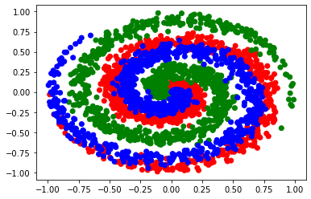
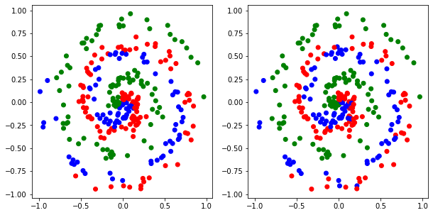
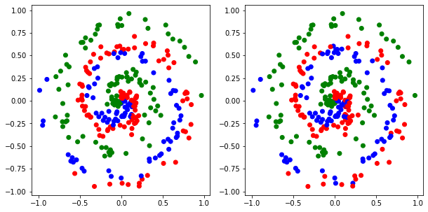
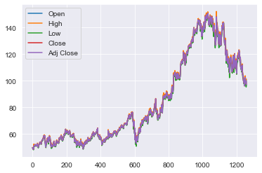
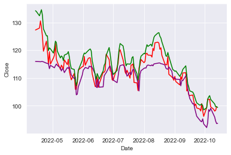
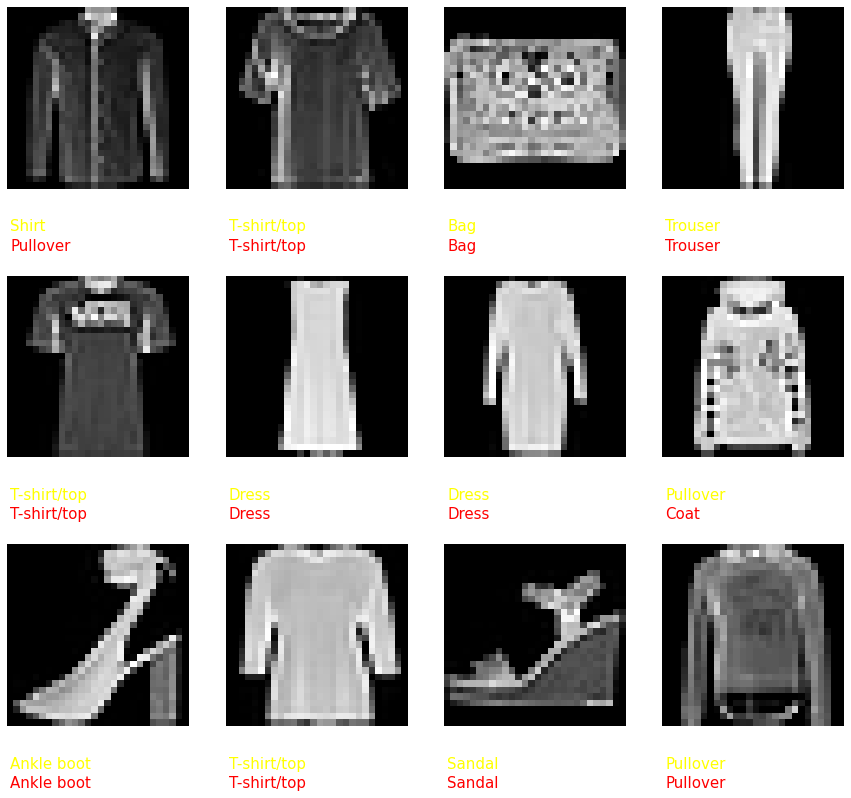

# Neuronal Networks in Python

The aim of this project 
implements, using only python (and numpy), deep learning structures which are 
being used in time series predictions, such as the SimpleRNN and 
the LSTM.  
The code written was tested on 3 different
datasets: MINST_fashion, the closing stock price of
Google for the last 5 years and the Spiral dataset, provided
by the nnfs package, used in the book.\
The aim of making this project was learning fundamental Neuronal
Networks and python concepts while getting 
familiar working with various datasets. \
In this project I have compared my own neuronal network
implementations with the tensorflow's keras implementations 
of the same classes in order to better interpret the
qualitative results. \
Many well known classes from the keras library were
implemented in this project among which:
*  Dense, SimpleRNN, Lstm (Layers)
*  ReLU, Sigmoid, Tanh (Activations)
*  CategoricalCrossEntropy, MeanSquaredError (Losses)
*  Adam, SgdMomentum (Optimizers)
*  Model

### Here are the results obtained on these 3 datasets:

### 1. The Spiral Dataset

\
\
*The true spiral dataset (the form of the full dataset)*

This dataset comprises 3 regions of space that 
belong to different classes. The model is required for a 
given set of points to determine the correct class in which
each of them belongs, thus having to learn the spiral shape
of the dataset. Within this example, each new point that is
generated has not been seen before by
the model because it is fitting to a
predetermined function.Here are the results:

\
*The prediction of the keras model vs the ground truth*

\
*The predicted classes by the custom-made model vs the ground truth*

____

### 2.Google stock price for the last 5 years

This data was extracted from Yahoo Finance and is
publicly available on the 
following link :
[Alphabet Inc. (Yahoo Finance)](https://finance.yahoo.com/quote/GOOG/history/?guccounter=1&guce_referrer=aHR0cHM6Ly93d3cuZ29vZ2xlLmNvbS8&guce_referrer_sig=AQAAADmk2eKXeDpMs22HUR-xgJEm8F7efFPl-96Rc_qg9VCA5PSrssd4Ztze7otzOkYlxxiGahfK2F4R7t0JO9msGBK7_Lz4OFv_UoNlwnKSmtKGbczuc3Xv6EkxudOFvahrEKxy_3MvaBThcqFbzhkSTh1nW502h1-J9hYQW_uGe4ZZ)
. It represents Alphabet Inc. stock data of the 
past 5 years (or the last 1256 trading days). Each datapoint is
composed of 5 entries: Open, High, Low, Close and Adj. Close
, which represent the most relevant metrics of a trading day.\
\
*The 5 entries plotted, making up the stock chart*

Based on these, our model will 
make its inferences and try to predict Closing price 
for the next day.
This Dataset will be split
in 5 slices, of which the first 4 will be
used for training
and the 5th will be used for testing. The following 
plot shows how the model performs on the 5th slice
of data, against the keras
implemented model and the true 
Closing price, after being trained the first 4 slices.

\
*Red: True closing price*\
*Green: Keras simpleRNN class inference*\
*Purple: The custom model simpleRNN class inference*

Here, the performance of the custom-made simpleRNN layer
suffers from the problem of balancing the gradient from
previous time steps,
showing therefor a visible difference between it and 
the keras model which mitigates this issue with more
complex mathematical procedures which are beyond the
scope of this project. Despite these limitations, it 
achieves a competitive performances and manages to 
reproduce the overall shape of the output. A custom-made 
LSTM cell was also tested on this dataset, but it
falls short of its keras counterpart.

____

### 3.MNIST Fashion Dataset

This is a dataset of Zalando's article images—consisting
of a 
training set of 60,000 examples and a test set 
of 10,000 examples. Each example is a 28x28 grayscale 
image, associated with a label from 10 classes. 
Fashion-MNIST is intended to serve as a direct drop-in 
replacement for the original MNIST dataset
for benchmarking machine learning algorithms.

\
*MNIST Fashion Dataset*

For this classification task the model is made up of 
3 Fully connected layers with 2 ReLU activation functions 
in between and a sigmoid activation function after the 
final layer. The training and validation data consist of
500 images loaded from each class(from the train folder)
, which sum up to 5000 total images, of which 4500 for 
training and 500 for validation. In the following image
the qualitative results of the 2 models can be seen.

*White - True label*\
*Yellow - Keras Model Prediction*\
*Red - Custom-made Model Prediction*

For testing the model, 100 more images are loaded from each class
(this time from the test folder) and then the predictions 
for both the custom-made model and the keras are made.
For this task
the final accuracies are 74.60% for the custom-made 
model and 82.15% for the keras model, both of which show 
the capacity of the models to learn relevant information 
from the data and make competent predictions on the test 
images.

## Credits

This project was inspired by the Neuronal Networks from
Scratch in Python Book, written by
Harrison Kinsley & Daniel Kukieła, which can 
be found at the
link: https://nnfs.io
The stock market data preprocessing was inspired by the 
code from the following github repository: 
https://github.com/bnsreenu/python_for_microscopists